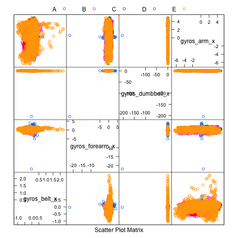

```{r setup, include=FALSE}
knitr::opts_chunk$set(echo = TRUE)
```

## Introduction

The purpose of this project is to apply machine learning techniques to a weight lifting exercise dataset in order to predict the manner in which participants executed the exercise. The dataset was collected and analyzed by Velloso et. al, and the paper with their results can be downloaded from http://groupware.les.inf.puc-rio.br/har. The dataset can also be downloaded from this site. The full reference for the paper is included below in the bibliography. 

Velloso et. al had 6 participants perform the Unilateral Dumbbel Biceps Curl in 5 different ways. These 5 classes of performance are as follows:

* Class A: performing the exercise correctly
* Class B: throwing the elbows to the front
* Class C: lifting the dumbbell only half way
* Class D: lowering the dumbbell only half way
* Class E: throwing the hips to the front

The data were collected from four sensors, one on the dumbbell, one on the forearm, one on the arm, and one on a belt. The goal of this project is to predict whether a particular execution of the exercise falls into Class A, Class B, Class C, Class D, or Class E using the sensor data. 

## The Question
An important step in data science is to formulate a question in order to guide the analysis. The given testing set of the data contains only raw data, and it is really too small to calculate meaningful statistical quantities. Therefore, for this project, I think a good question would be, can a subset of the raw sensor data be found that distinguishes among the five classes? 

## The Data
The weight lifting data was already divided into a training set and a testing set. The training set contains both the raw data and the statistical data derived from the raw data. I had initially performed my analysis of the data on only the statistical quantities, as I thought that would be more informative; but I later discovered that the testing set only has the raw data. 

I noticed that many columns in the training set had blank fields, so I set both blank fields and NA to be missing values. I then removed all the columns containing the statistical quantities, such as averages, variances, kurtosis and skewness values, etc. Most of the values in these columns were NA, so I removed these columns by doing a count of NA values on every column. The columns with the raw data all had 0 missing values.

The first column was simply an index for the rows, the second column (user_name) contained the names of the participants, the third and fourth columns contained time stamps, the fifth column contained the date, and the sixth and seventh columns contained information about the time windows. These columns did not contain any information specific to classes A, B, C, D, and E, so these were also removed. I think the time and username columns could be useful in a more detailed analysis in order to arrange the data chronologically and take into account how each variable depends on time for each class, but the scant testing set didn't really allow for this kind of analysis. 

The last column, "classe", contained the outcome variable. The remaining columns contained acceleration data in the x, y, and z directions; total acceleration; magnetometor readings in the x, y, z directions; gyroscope readings in the x, y, z directions; and yaw, roll, and pitch readings. These quantities were measured for each sensor--belt, dumbbell, forearm, and arm--for a total of 52 possible predictors. 

## Feature Selection
In order to get an idea of which variables might be useful I constructed feature plots using the caret package for each category of measurement (e.g. acceleration in the x direction or pitch measurements). Figure 1 shows a feature plot for gyroscope measurements in the x direction. The 5 classes don't separate very well for this variable. Figure 2 shows a feature plot for the pitch variable. The separation is still not great, but it is better than what is seen in Fig. 1. 




Based on the feature plots, I decided to remove the variables associated with the gyroscope readings, with acceleration in the y direction, and with total acceleration. In particular, I kept the following 32 variables as predictors:

* accel\_dumbbell\_x
* accel_forearm_x
* accel_belt_x
* accel_arm_x
* accel\_dumbbell\_z
* accel_forearm_z
* accel_belt_z
* accel_arm_z
* magnet_dumbbell_x
* magnet_forearm_x
* magnet_belt_x
* magnet_arm_x
* magnet_dumbbell_y
* magnet_forearm_y
* magnet_belt_y
* magnet_arm_y
* magnet_dumbbell_z
* magnet_forearm_z
* magnet_belt_z
* magnet_arm_z
* yaw_dumbbell
* yaw_forearm
* yaw_belt
* yaw_arm
* roll_dumbbell
* roll_forearm
* roll_belt
* roll_arm
* pitch_dumbbell
* pitch_forearm
* pitch_belt
* pitch_arm

Note: Below I include some sample code of how I generated one of the feature plots.

```{ echo=FALSE}
library(caret)
training1 <- read.csv("pml-training.csv", na.strings = c("", "NA"))
stat_quant <- apply( training1, 2, function(x){ sum( is.na(x) ) > 0 })
training2 <- training1[, !stat_quant]
training2 <- training2[ training2 == "#DIV/0!" ] = NA

pitch <- c( "pitch_belt", "pitch_forearm", "pitch_dumbbell", "pitch_arm" )
plot13 <- featurePlot( x = training2[ , pitch ], y = training2$classe, plot = "pairs"
                       auto.key = list( columns = 5 ) )
print(plot13)
dev.off()
```

## Algorithms
I decided to start with the random forest algorithm, since this algorithm was mentioned in the paper by Velloso et. al. I divided the training set into a smaller training set and a validation set. For the validation set, I chose the data associated with user_name = charles. 

With the new training set, I ordered the rows chronologically, which also had the effect of clustering the username and classe variables. I performed 5-fold cross-validation with the random forest algorithm. My idea behind choosing k = 5, was that there are five participants, and these were already arranged in blocks. So, each insample "testing" set would contain data mostly from one participant.  

In the final model, I achieved about 99.3% accuracy, but when predicting on the validation set, I got terrible accuracy, about 54%. I tried using a different participant for the validation set (adelmo), and I got even worse results. I also tried using the bootstrapping method of cross-validation but obtained only slightly better results. Finally, I tried using method = "rpart" and method = "gbm", but these did not perform as well as the random forest algorithm. The results of the final model as well as the confusion matrix for the validation set are shown below. 


```{r, message=FALSE, warning=FALSE}
source("project_ml2.R")
rf_model
rf_model$finalModel

# confusion matrix for the validation set
cm
```

## Evaluation
My initial guess as to why my prediction results were so poor was that I needed to standardize the variables, but this did not solve the problem. From what I have read, the predict function applies the appropriate standardization to the test set when the model object is passed to it as I did below, where "valid" is the validation set. Perhaps I am wrong on this point.

```{r, eval = FALSE}
rf_pred <- predict( rf_model, newdata = valid )
```

I have also read that the random forest algorithm doesn't perform well when there are many predictors, as there is a problem with overfitting. I did an analysis with only 16 predictors, but I got poorer results. 

I suspect one of the main issues is that the raw data are not the best predictors. When I did the analysis using the statistical quantities, I was able to get an accuracy of 66% on the validation set, which is still not great but much better. 

Based on my results, I expect the out-of-sample error to be rather large, about 50%. On the other hand, when I resample within the training set with the 5 participants and create the new confusion matrix, I still get over 99% accuracy. Since in the out of sample testing set there is only one data point associated with "charles" (the participant I used for the validation set), perhaps the accuracy will be significantly better than 50%. 

## Bibliography
Velloso, E.; Bulling, A.; Gellersen, H.; Ugulino, W.; Fuks, H. Qualitative Activity Recognition of Weight Lifting Exercises. Proceedings of 4th International Conference in Cooperation with SIGCHI (Augmented Human '13) . Stuttgart, Germany: ACM SIGCHI, 2013.

## Source Code
```{r, eval = FALSE}
# R script to do machine learning on weight lifting exercise data
# For Course Project on Practical Machine Learning from Coursera
#
# load in libraries
library(caret)
library(rpart)
library(randomForest)
library(dplyr)
library(tidyr)
library(ggplot2)
library(lattice)

# Read in data
training1 <- read.csv("pml-training.csv", na.strings = c("", "NA") )
testing1 <- read.csv("pml-testing.csv", na.strings = c("", "NA" ) )

# remove statistical quantities
stat_quant <- apply( training1, 2, function(x){ sum( is.na(x) ) > 0 } )
training2 <- training1[ , !stat_quant ]

# remove gyroscope measurements as well as acceleration in the y direction and 
# total acceleration measurements
omit <- grep("gyro|^accel(.*)y|^total", names(training2) )
training2 <- training2[ , -omit ]

# remove these for the test set as well. In addition, remove the last column
# (problem_id)
testing2 <- testing1[ , !stat_quant]
testing2 <- testing2[ , -c(1:7, omit, ncol(testing2))]

# next, convert "#DIV/0!" values to NA (I think these were only in 
# the columns with the statistical quantities, but let's apply this 
# to the other columns just in case.)
training2[ training2 == "#DIV/0!" ] = NA

# Let's also omit the index, time, date, window, and username variables
training2 <- training2[ , -c(1,5,6,7)]

# next, select only the rows that have complete cases
training2 <- training2[ complete.cases(training2) ,]

# order chronologically for k-fold cross-validation
training2 <- with(training2, training2[ order(user_name, raw_timestamp_part_1 ),] )

# some of the column names misspelled "pitch" as "picth", so correct this error
# (I am assuming it is an error, I could be wrong)
new_names <- gsub("picth", "pitch", names(training2) )
names(training2) <- new_names

# divide training set into training and validation sets
training <- training2[ training2$user_name != "charles", ]
training_true <- training$classe
training <- training[ , -c(1,2,3,ncol(training))]

valid <- training2[ training2$user_name == "charles", ]
valid_true <- valid$classe
valid <- valid[ , -c(1,2,3,ncol(valid))]

set.seed(1443)
# use random forests to train
rf_model <- train( training, training_true, method = "rf", preProcess = c("center", "scale"), trControl = trainControl( method = "cv", number = 5 ) )

rf_pred <- predict( rf_model, newdata = valid )
cm <- confusionMatrix( rf_pred, valid_true )

# final prediction
rf_pred2 <- predict( rf_model, newdata = testing2 )

```

